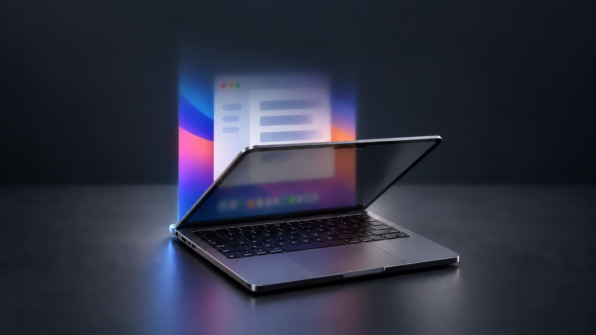

# MacDuo



*Concept render of the perceived upright image plane.*

A Swift menu bar app that makes your desktop appear to stay upright as you close your MacBook lid, with progressive blur and fading.

It prepares a screenshot at 92° and eases into the effect below 90°. Opening the lid to 90° restores your desktop.

## Build and run

Requires an Apple Silicon MacBook with a compatible lid-angle sensor, macOS 14+, and the Xcode Command Line Tools. Tested on an M4 Max MacBook Pro.

```sh
git clone https://github.com/dakdevs/MacDuo.git
cd MacDuo
./Scripts/build.sh
open MacDuo.app
```

Install missing command line tools with `xcode-select --install`. The app is built locally and is not notarized.

## Use

1. Choose **Allow Screen Recording** and enable MacDuo in **System Settings → Privacy & Security → Screen & System Audio Recording**. Relaunch if prompted.
2. Open **Preview & calibration** from the menu bar to adjust the effect for your eye position.
3. Click **Enable effect** and lower the lid below 90°.

Press **Control–Option–Command–L** to pause. The menu also includes an eight-second demo.

## Things to know

- MacDuo takes one screenshot per gesture and keeps it in memory. It records no video or audio and uploads nothing. macOS requires Screen Recording permission even for screenshots.
- The desktop image stays frozen during the effect. Mouse clicks still use their original coordinates, so pause before working below 90°.
- The illusion depends on your eye position and crops content that extends beyond the physical screen. Sleep and lock continue to work normally.

## Development

Run `./Scripts/verify.sh` on a compatible MacBook. See [verification](VERIFICATION.md), [design](DESIGN.md), and [contributing](CONTRIBUTING.md) for details.

## Credits and license

Inspired by [iphone-duo-macos-animation](https://github.com/lqSky7/iphone-duo-macos-animation), with sensor research from [LidAngleSensor](https://github.com/samhenrigold/LidAngleSensor). See [acknowledgments](THIRD_PARTY_NOTICES.md).

[MIT license](LICENSE).
